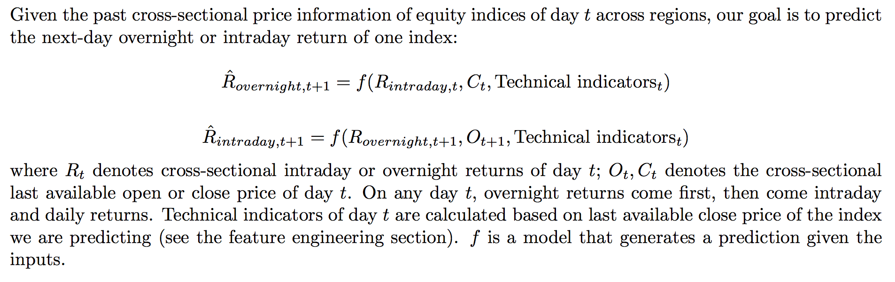
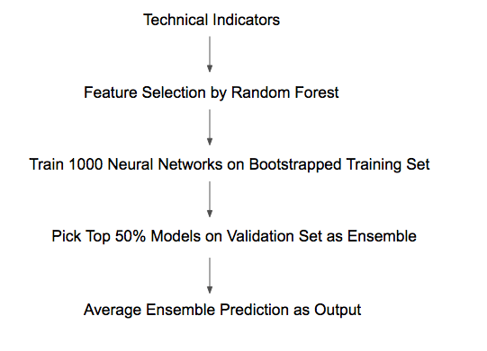
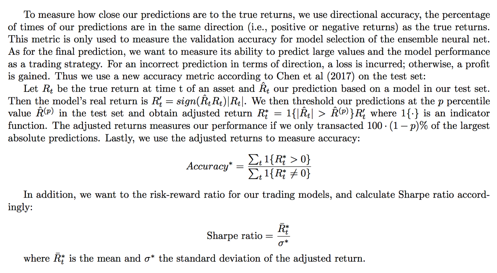
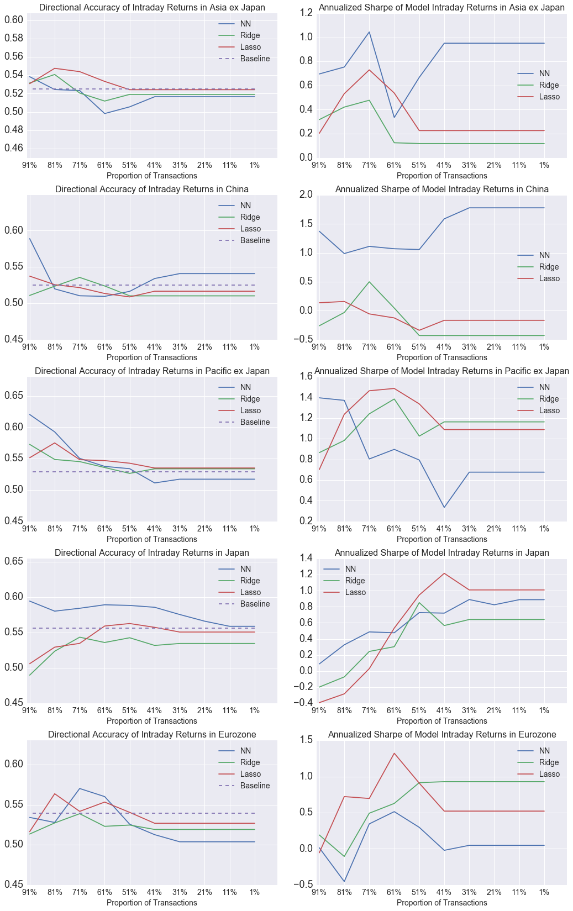
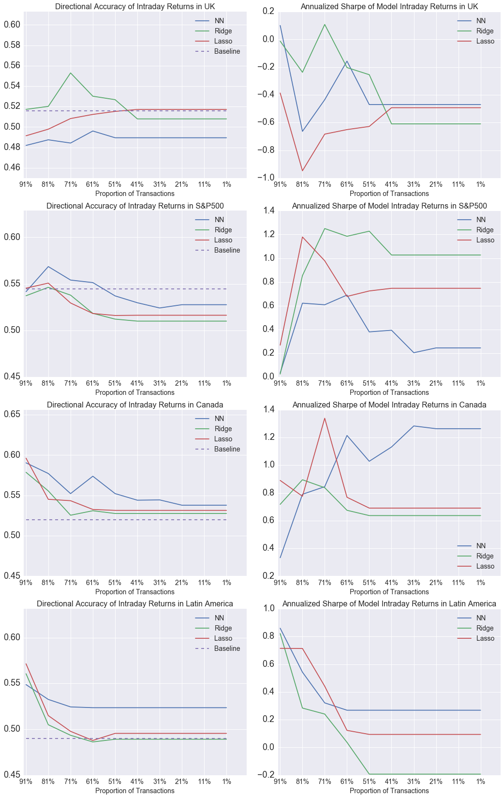
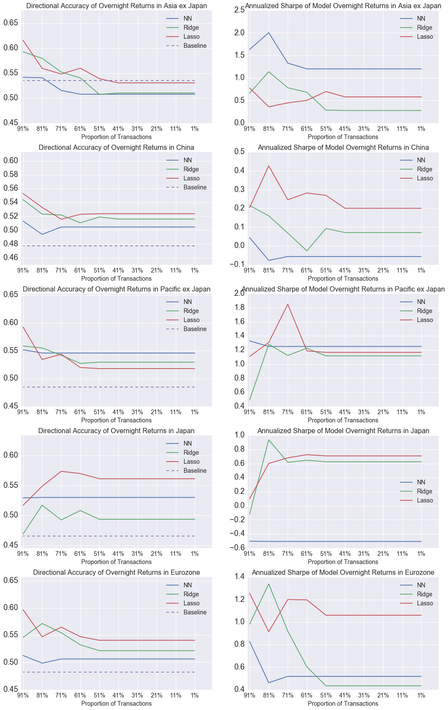
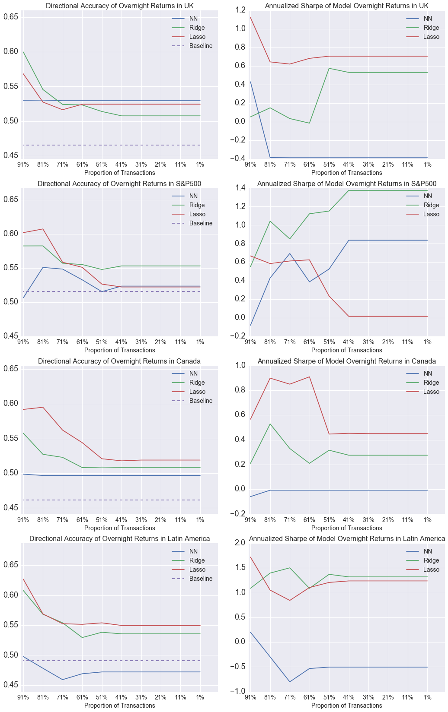

#    International Stock Market Prediction using Artificial Neural Networks
##    AC 299r Independent Study 

### Chang Liu 
### Supervisor: Neil Shephard

## Motivation

A body of literature in financial economics suggests that international equity markets can have cross-market momentum, where one market in a region correlates with another market in that region (or possibly in a different region) in a lagged manner. Profitable trading strategies are devised to exploit the predictability of future prices using cross market momentum. With the promising predictive power of neural networks in many successful applications including finance time series prediction, we are motivated to apply neural networks with powerful learning capacity to predict international stock market. 

Previous studies primarily focus on the dynamics among selected major country indices such as the US, UK, Germany, and China, while ignoring the dynamics with other countries in the same region or across regions. In this study, we seek to investigate the price predictability of the international equity indices by looking at regional indices as well as major country indices that cover the world equity markets according to the MSCI world classification. We use large, liquid iShares Exchange-Traded-Funds (ETF) and SPDR S&P 500 ETF data downloaded from Yahoo! Finance. 

## Methodology
### Problem Statement

It is a common issue that spurious cross-autocorrelation can be a result of thinly traded markets, asynchronous trading, or both. To minimize these impacts, we have used large, liquid iShares Exchange-Traded-Funds (ETF) trade data for international equity indices downloaded from Yahoo! Finance. Most of the international ETFs track the MSCI equity regional or country indices and trade in the US market hours. For the US market, we use SPDR S\&P 500 ETF data downloaded from Yahoo! Finance. The coverage of ETFs is similar to the MSCI world equity index classification, except that we have both major country indices and the regional indices excluding countries (which usually make up a substantial percentage of the regional index capitalization), in order to better separate the effect of the two. The comprehensive coverage also represents three major market time zones: Asia and Pacific, Europe, and America time zones.

Further, we break daily returns of a region or country into intraday and overnight returns that are driven by fundamentally different drivers, depending on the overlapping time zones and hence formulate the following problem:

### Feature Engineering 
The following momentum indicators are selected from the literature [nikkei, chen] that are reported to have the more predictive power than other technical indicators. They are all based on price and volume information at or before time t:
- Exponential and Simple Moving Averages over k-period rolling window
- Past k-period volatility
- AD: number of advancing stocks at time t minus that of declining stocks
- ADV: volume of advancing stocks at time t minus that of declining stocks
- Past k-period change in price
- Past k-period log return
- Past k-period stochastic oscillator %K and stochastic oscillator %D
- Larry William's R%
- Disparity
- Day of week
The parameter k is selected by the author within a range of 5 days for all indicators. For exponential moving averages, k = 1,2,3...,10,15,20,25. 

### Feature Selection
With the above technical indicators, and 3 types of (lagged intraday/overnight/daily) cross-sectional returns, plus the last available price of the target region, we have more than 60 input features with much redundant information. From practice, it adds noise that the neural network confuses with signals so that the results are not satisfactory. We use 1000 Random Forest Regressors with Mean Square Error as the criterion for selecting the top 20 optimal features in the total in-sample period (i.e. the samples that model is allowed to see in during training and validation). 

### Neural Network Architecture
- A 2-layer fully-connected network: 20 input units - 24 hidden units - 3 hidden units - 1 output unit
- Mean Square Loss function
- ADAM optimizer 
- ReLu activation for all nodes except linear activation for output node
- L2 penalty; max norm constraints of weights; dropout layers
- Monitor training process – early stopping if validation not improving
- Normalize inputs by z-score transformation

### Ensemble Forecasting Method
We break the time series into multiple rolling windows of training-validation-test sets. For each window, we train 1000 neural networks on the training set and choose the top 50% models by accuracy rates on the validation set. They form a committee and output an average prediction as the final decision. The prediction pipeline can be summarized as follows:

### Evaluation Metrics

## Experimental Results
We test our models from 2015-09-08 to 2017-04-07 over 400 market days for Asia ex Japan which fewer data, and from 2015-02-05 to 2017-04-07 over 800 market days for all other regions. Results are shown as follows. For comparison, a baseline is calculated as the fraction of positive returns in the test set, which does not vary with the proportion of transaction. 

We can make several observations:
-   For overnight returns, on average, all the models perform slightly
    better than the baseline, except for Asia ex Japan. For intraday
    returns, on average, the models perform on par with the baselines.
    This suggests that there is predictive information in the features
    of overnight returns across all regions. One reason might be that
    the trading outside the exchange hours does not happen as often as
    within them, so that the market does not react as timely as
    information arrives. In addition, in a less efficient after-hour
    market, the bid-ask spreads are probably higher in trading;
    therefore, to access the execution feasibility of the trading
    strategy, it would be helpful to compute the break-even trading
    costs based on our model returns to compare with real-world trading
    costs.

-   A prediction accuracy higher than the baseline is not always
    equivalent to a good Sharpe ratio or feasible strategy; nor does a
    feasible strategy require a high prediction accuracy. For example,
    our ensemble neural net has below baseline accuracy in predicting
    overnight returns in Asia ex Japan. Yet, its Sharpe ratio is
    significantly above 1.0 and outperforms the benchmark models. This
    suggests a small proportion of good predictions that turn out to
    earn large returns can outweigh a large proportion of bad
    predictions with smaller losses. On the other hand, the benchmark
    models with higher-than-baseline accuracy, for example in predicting
    Canada overnight returns, can have zero or even negative Sharpe
    ratios. Therefore, it is important to observe consistency in both
    accuracy and Sharpe ratio curves to confirm performance stability of
    a model.

-   In terms of Sharpe ratio, our ensemble neural net outperforms the
    benchmarks in predicting intraday returns in China and overnight
    returns in Asia ex Japan. In all other cases, its performance is on
    average at par or even worse than the benchmark models. The sub-par
    performance highlights one potential issue with the neural net that
    the ensemble after model averaging can still have variation that
    cause performance instability, because the neural nets with powerful
    learning capacity can mistake noises as true patterns in the data.
    However, given the large set of neural network hyper-parameters
    (precise architecture, learning rate, convergence criteria,
    regularization, etc), we have minimal amount of fine-tuning the
    algorithm, striking a balance between an overly-tuned model and
    simplicity. It is certainly possible to select optimal parameters
    using other machine learning algorithms such as particle swarm
    optimization and genetic algorithm. Another explanation for the
    performance instability is that we have given very similar input
    features for all experiments; however, returns of different types
    and regions may have different dynamics and require specialized
    features.

## Concluding Remarks

In this study, we propose to predict the intraday and overnight returns
of international equity indices that cover most of the world equity
markets. To minimize spurious correlations due to low liquid or
asynchronous trading, we use large, liquid Exchange-Traded-Funds trade
data that closely track MSCI regional indexes or the S&P 500. We aim to
predict the next intraday or overnight returns of an ETF based on the
last available price and volume information. We computed the technical
indicators of the price and volume information and selected the most
important features as inputs. Then we train an ensemble of neural
networks and benchmark it with Lasso and Ridge, in terms of adjusted
accuracy rates and Sharpe ratio. The results show that in all regions
except for Asia ex Japan, all the models outperform the baseline in
predicting overnight returns in terms of directional accuracy, which
suggests predictability of cross-market momentum. However, quantifying
to what extent the result can be attributed to thin markets for
overnight returns is outside the scope of this study.

In addition, our ensemble of 2-layer models is on average on par with
the regularized linear models as benchmarks. This highlight some issues
regarding application of neural networks to financial time series: 1)
much of the nuisance the neural net learns (better than a simple linear
model) in financial time series can be just noise, which is random or
inherently unpredictable. 2) to fine-tuning an ensemble to beat linear
methods, the computational cost and risks of over-fitting are high; and 
3) to improve the overall performance, no matter what method to use, one
could focus on engineering the appropriate features in addition to
tuning the model.

### References

A. N. Burgess. *Modelling relationships between international equity
markets using computational intelligence*, Knowledge-Based Intelligent
Electronic Systems, 1998. Proceedings KES ’98. 1998 Second International
Conference on, Adelaide, SA, 1998, pp. 13-22 vol.3. doi:
10.1109/KES.1998.725946

Andrew W. Lo, A. Craig MacKinlay. *When Are Contrarian Profits Due to
Stock Market Overreaction?*. Rev Financ Stud 1990; 3 (2): 175-205. doi:
10.1093/rfs/3.2.175

Hao Chen, Keli Xiao, Jinwen Sun, and Song Wu. 2017. *A Double-Layer
Neural Network Framework for High-Frequency Forecasting*. ACM Trans.
Manage. Inf. Syst. 7, 4, Article 11 (January 2017), 17 pages. DOI:
https://doi.org/10.1145/3021380

Hargreaves, Carol; Yi Hao. *Prediction of Stock Performance Using
Analytical Techniques*. Journal of Emerging Technologies in Web
Intelligence. May 2013, Vol. 5 Issue 2, p136-142. 7p.

Leung, Tim and Kang, Jamie Juhee. *Asynchronous ADRs: Overnight vs
Intraday Returns and Trading Strategies* (October 23, 2016). Studies in
Economics & Finance, 2016, Forthcoming. Available at SSRN:
https://ssrn.com/abstract=2858048

Qiu M, Song Y. *Predicting the Direction of Stock Market Index Movement
Using an Optimized Artificial Neural Network Model*. PLoS ONE 11(5):
e0155133 (2016). https://doi.org/10.1371/journal.pone.0155133

Selmi, N., Chaabene, S & Hachicha, N. *Forecasting returns on a stock
market using Artificial Neural Networks and GARCH family models:
Evidence of stock market S & P 500*.Decision Science Letters, 4(2),
203-210 (2015).

Y. Yetis, H. Kaplan and M. Jamshidi. *Stock market prediction by using
artificial neural network*. 2014 World Automation Congress (WAC),
Waikoloa, HI, 2014, pp. 718-722. doi: 10.1109/WAC.2014.6936118

Yanshan Wang. 2014. *Stock price direction prediction by directly using
prices data: an empirical study on the KOSPI and HSI*. Int. J. Bus.
Intell. Data Min. 9, 2 (October 2014), 145-160.
DOI=http://dx.doi.org/10.1504/IJBIDM.2014.065091

